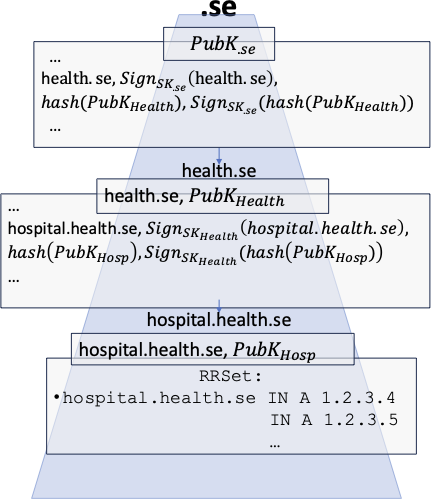

- [DNS Digital Emblem](#dns-digital-emblem)
  - [Components](#components)
  - [Workflow](#workflow)
    - [Pending changes to the Workflow](#pending-changes-to-the-workflow)
  - [Installation](#installation)
  - [Usage](#usage)
  - [Publishing DNS Records Manually](#publishing-dns-records-manually)
    - [Infoblox](#infoblox)
      - [Approver CA TLSA Record](#approver-ca-tlsa-record)
      - [Requestor EE TLSA Record](#requestor-ee-tlsa-record)
  - [Future Steps](#future-steps)

# DNS Digital Emblem

~~CyberNorms is funded internally accross AOS and NSAD.~~ The goal of the project is to support humanitarian and relief organizations as well as establishing internet standards. The digital emblem serves as an indicator to malicious parties that the ICRC, or any hospital, is a non-partisan entity and is just trying to help people.
This implementation uses DNSSec, specifically TLSA DANE (RFC 6698) to authenticate digital emblems which entities entitled to protections under international law can display signed attestations of their (respective) identities and protected status.
The end goal is to enable authentication for both the simpler case where the Requestor resides in a sub-zone controlled by the Approver as well as one where the Approver's domain name resides in a different zone than the Requestor (as may be the case in countries like the United States). 





## Components
- __Acme Server__: To be controlled by Approver 
- __Acme Client__: To be controlled by Requestor


## Workflow

> [!NOTE]
> **Since the original workflow section was written, it was determined that the requestor would publish a TLSA
record referring to an EE-cert signed by the approver (CA) in-lieu of a signed TXT record.**
> **In light of this, the workflow is currently undegoing several changes [listed below](#pending-changes-to-the-workflow).**


1. Publish the approver's domain in a TLSA record. The data of the TLSA record will be a certificate containing the approver's public key and signed by their private key.
2. ~~Requester sends their domain and justification to receive and display the emblem~~
3. ~~Approver generates a nonce and signs the nonce and requester domain~~
4. ~~Approver sends back the nonce and digital signature to the requester~~
5. ~~Requester publishes the emblem in a TXT record under their domain containing: nonce, approver domain, and signature.~~
~~1. Additionally, there's a verification script, which takes the nonce and signature from the TXT record and extracts the public key from the certificate in the TLSA record to verify the emblem.~~

### Pending changes to the Workflow

1. The authorizer will need to be a CA and to authenticate/sign digital emblems by issuing an EE-certificate to the
requestor and signing it. 
2. Since both initial issuance of EE-certificates and their periodic renewal/reissuance will be
common occurrences, this process will need to be automated. This branch will implement this automatization process using
Automatic Certificate Management Environment (ACME) as originally specified in
[rfc8555](https://www.rfc-editor.org/rfc/rfc8555). The use of Javascript Web Tokens (JWT) authentication as originally defined will be replaced by the [`dns-01`](https://www.rfc-editor.org/rfc/rfc8555#section-8.4) challenge-response
procedure defined in RFC 8555 §8.4.

## Installation

Install Python 3.11 as follows:

- Ubuntu:
  ```bash
  sudo add-apt-repository ppa:deadsnakes/ppa
  sudo apt update
  sudo install python3.11
  ```

- macOS:
  ```bash
  brew install python3.11
  ```

Then install [Poetry dependency manager](https://python-poetry.org) as follows:

- Ubuntu:
  ```bash
  curl -sSL https://install.python-poetry.org | python3.11 -
  poetry completions bash >> ~/.bash_completion
  ```
- macOS:
  ```bash
  brew install poetry
  ```

Get the project and initialize the environment:
```bash
git clone https://github.com/bkhabs/digital-emblem.git
cd digital-emblem/prototype
poetry config virtualenvs.in-project true   # changes venv location to project root
poetry env use python3.11   # specifies homebrewed python and creates virtual env with this interpreter
```

If running on JHUAPL internal network or other corporate intranet, the following must also be run to bypass SSL verification errors:
```bash
export PYTHONWARNINGS="ignore:Unverified HTTPS request"
poetry source add pypi
poetry config certificates.pypi.cert false
poetry source add fpho https://files.pythonhosted.org
poetry config certificates.fpho.cert false
```

Now get the required dependencies:
```bash
poetry install
```

Finally enter the poetry virtual env subshell:
```bash
poetry shell
```

Now we are ready to run the python scripts; proceed to [Usage](#usage).

When finished running things, run `exit` to leave the subshell

## Usage

Here is an overview of the usage of all the files and the order you would run them in:

- [`./tlsarecord.py`](tlsarecord.py) can be run in two modes:
   
  - `./tlsarecord.py isCA` creates the CA certificate for the approver domain (AD), which is currently `_443._tcp.#.icrc.jhuapl.org`, where `#` is determined by the [ca-cert counter](./ca-cert/counter.txt). This should be published to a TLSA record for the AD (as explained [below](#approver-ca-tlsa-record)). There will be 4 files generated:
  
    - \<AD\>_cert.pem - certificate PEM
    - \<AD\>_cert.hex - certificate bytes represented as hex string
    - \<AD\>_priv.key.pem - private key PEM
    - \<AD\>_pub.key.pem - public key PEM
  
  - `./tlsarecord.py` creates the EE CSR (certificate signing request) for the requestor domain (RD), which is currently `_443._tcp.#.rescue.icrc-external.jhuapl.org`, where `#` is determined by the [ee-cert counter](./ee-cert/counter.txt). This should be published to a TLSA record for the RD. There will be 4 files generated:
  
    - \<RD\>_csr.pem - CSR PEM
    - \<RD\>_csr.hex - CSR bytes represented as hex string
    - \<RD\>_priv.key.pem - private key PEM
    - \<RD\>_pub.key.pem - public key PEM

## Publishing DNS Records Manually

### Infoblox

From the Infoblox web UI, click on Data Management -> DNS -> External -> jhuapl.org. Then on the right toolbar, click the drop-down menu next to Add -> Record and pick TLSA Record.

#### Approver CA TLSA Record

Assuming the current AD is `_443._tcp.2.icrc.jhuapl.org`:

| field | value |
|--|--|
| Port | 443 (HTTPS) |
| Protocol | tcp |
| Name | 2.icrc |
| Certificate Usage | DANE-EE |
| Selector | Full certificate |
| Matched Type | No hash |
| Certificate Data | *paste the contents of \<AD\>_cert.hex (located at crypto/_443._tcp.2.icrc.jhuapl.org_cert.hex) here* |

#### Requestor EE TLSA Record

*TODO*

## Future Steps

- Integrating with ACME
  - Calling DNS management API for ACME client to create TXT record for DNS-01 challenge
- Implementing a streamlined way to publish the TLSA records for requestor
